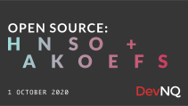
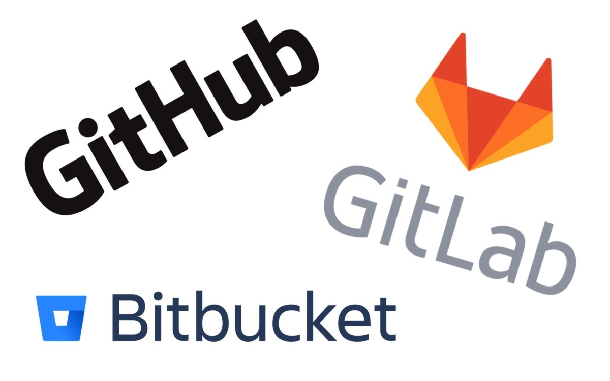
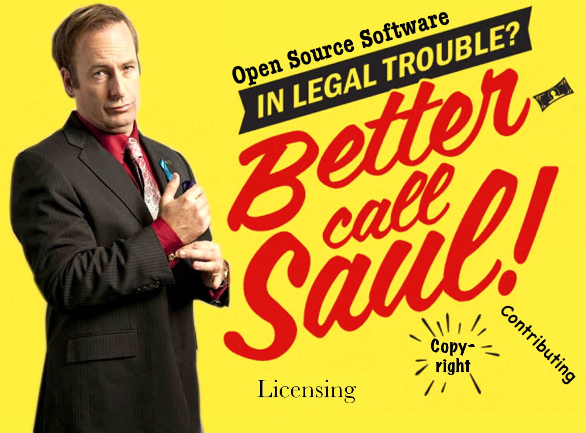

<!-- .slide: data-background="#363636" -->
 <!-- .element class="plain" -->

https://strawpoll.me/21028984

---

What did the programmer say after being
<br>
arrested for writing unreadable code?

---

## `// No comment`

---

<!-- .slide: data-background="#363636" -->
 <!-- .element class="plain" -->

Notes:
* OPEN source - what, why you'd contribute, what to expect
  * It's okay to report issues, ask questions, suggest fixes
* Two sides: the techincal coding & non-technical, "social" side of getting your code accepted
* Hacktoberfest & T-shirts
* Live coding: will walk you through 4 different examples
* Ask questions! via chat or just chime in; mics muted otherwise

---

# 👨🏼‍💻
## David Beitey
#### @davidjb / @davidjb_
## 🧢🎩👒⛑🎓🕵🏻‍♂️

Notes:
* Wear lots of hats
* Live in North Queensland
* Security researcher - white hat
* Work with RedHat Linux
* & Systems Administrator and DevOps at JCU: elaborate

---

# 🕴 <!-- .element style="font-size: 15rem;" -->

# 🚫

Notes:
* I like this Emoji, but that's not tonight's talk
* Business Man Levitating

---

## `git commit(ted)`

Notes:
* Open souce contributor & maintainer of several projects at work and personally
* First PR over 9 years ago and I've made 515 more since then, just on GitHub.
  * Not counting commits etc, just PRs to _other_ projects
  * https://github.com/collective/transmogrify.webcrawler/pull/3
  * Not actually a terrible PR tbh, except for the title (ugh)

---

<!-- .slide: data-background="#363636" -->
 <!-- .element class="plain" style="max-height: 80vh" -->

Notes:
* Could talk open source any time of the year, but now is a **really** special time
* Several years back a few tech companies got together (GitHub, Digital Ocean, Twilio etc) and coined Hacktobefest; different sponsors come and go
* Celebration of open source, encouraging people to get involved
* Fuzzy feelings aside, 4 pull requests to open source projects between 1-31 October = shirt + stickers (or a tree this year)
* For the betterment of code and community (+ free advertising for them ;)
  * DigitalOcean: like AWS, cheaper
  * Intel: yeah
  * Dev.to: social network for devs, like HackerNews/Reddit kinda

---

### Sign up
#### [hacktoberfest.digitalocean.com](https://hacktoberfest.digitalocean.com)

Notes:
* Must have a GitHub account, link to your Hacktoberfest account so your PRs can be tracked
* I don't know Git! You can still edit/push via the web. In fact, I use this
  for really simple changes and mobile; faster + .md rendering etc
* Click through to hacktoberfest.digitalocean.com and it'll prompt to link accounts
* There are rules - no spam, etc - so try and make your changes as meaningful as you can
  * Must not be marked as inappropriate or spam in 7 days

---

#### Pull Request #1:
## Documentation

 <!-- .element class="plain logo" -->

https://github.com/kodi-pvr/pvr.iptvsimple

Notes:
* I've collated 4 projects to contribute to tonight & walk through the differences in projects

  * May be a little jumping around so stop me if go too quickly
  * Ask questions at any time

* I use Kodi as a media player, found this add-on, read about it and its readme -- noticed the typo

* Firstly going to check licensing to make sure I can contribute -- click `LICENSE.md` and show GH's UI

  * Licenses govern what you & others can/can't do with code, particularly re-use, resale, modifications etc
  * If there wasn't a licence, open an issue to nicely request/suggest one

* Edit README.md on GitHub

  * `Settingds` words - saw this, found others to improve
  * Capital K for `kodi` - several spots
  * Incorrect `it's` (4 of them?)
  * `hexadeciaml genreId's` --> hexadecimal genre IDs
  * `imortant` - important

* Commit with a reasonable message - demo over 50 chars- and save
* Check diff
* PR:

  * Explain what happens when I click the button; point of actual action being taken (issues/PR can be closed but not deleted by you)
  * Create PR with basic description & done
  * Now what?

    * Me submitting this PR triggers an email to any maintainer watching this on GH
    * Project decide to accept or respond to the PR on Github

* Review:

  * Tech side is easy - simple changes, one file; no real guidance but just follow existing style
  * Social side is easy - no contributor docs (status quo), no wiki, nothing in readme, active/open PRs, has CI tests but only for the C code
  * Could have start by opening an issue, but this is simple & doesn't really warannt discussion (people have debated its with me)
  * PRs feature ability to conduct reviews, line-by-line comments and discussion about changes etc; threaded conversation

---

## Wait, what?

Notes:
* That was Open Source (software)!
* We just offered a change to someone else's software!
* But what is it, really?

---

 <!-- .element class="plain stretch" style="max-width: 40vw;" -->

Notes:
* Open Source Initiative (OSI) defines it best: development based upon the sharing and collaborative improvement of software source code.
* First coined in 1998 after the release of Netscape's source code
* Not everything available publicly is open source (freeware, shareware, etc) - generally refers to things with a permissive licence for reuse, otherwise known as "Free & Open Source Software"
* Term gets applied to lots of things, but tonight we're talking _software_
* For the purists among us, take the simple view that Free == Open Source

---

 <!-- .element class="plain stretch" style="max-height: 60vh;" -->

<small>
Source: Himanshu Mishra, hackernoon.com
</small>

Notes:
* Where does it turn up?  Everywhere: Browsers (FF, Chrome), Linux, programming languages like Python/Node.js/Ruby, websites, web apps, embedded devices, everywhere.

---

## Using & Contributing

Notes:
* Why use it?
  * Program your app for free (just add libaries and tools vs starting from scratch)
  * Adapability - free stating point
  * Community support
  * Compare: ability to reuse, inspect, contribute vs closed-source platform

* Contributing: why/how? Fix a bug, implement a feature, contribute back to the community

  * Code, documentation, tests, website fixes, typos & other corrections
  * As I said before, it's okay to report issues, ask questions, suggest fixes

* For me, it's two fold:

  * My job: things I do for work - build my own software OR contribute to the community (the latter is typically easier)
  * Got contacted by a guy in Europe offering to do work for free (he was
    being paid by a University): https://github.com/nginx-shib/ - who would
    say no to that offer??
  * My personal life: things I work on at home - Home Assistant automation
  * These PRs tonight are real things that matter to me

---

 <!-- .element class="plain stretch" style="max-height: 40vh;" -->

* Terminology:
  * Pull request (PR)
  * Merge request (MR)
  * Patch
  * Forking 🍴

Notes:
* Haven't really needed to understand version control / Git so far, but you should learn
  * Git isn't the only VCS out there; Hg, SVN
* Know the difference between Git (the VCS) and the host (GH/GL/BB, etc)
* Hosting platforms: GitHub, GitLab; BitBucket; sourceforge; self-hosted; etc

* Terminology differs: fork; pull/merge request PR/MR; but they have similar
  functionality
* Hacktoberfest is only on GitHub; but not everything lives there!

---

”A `git pull` a day keeps the conflicts away”

Notes:
* Topics to research: rebasing, squashing, cherry-pick, editing commit messages
* Lots more to it for bigger commits

---

# Action!

Notes:
* Right, back to the programming

---

#### Pull Request #2:
## Code examples

# 👍
`react-use`

<br>

* https://github.com/streamich/react-use
* https://reactjs.org/

Notes:
* React is a JS lib for building UI
* react-use is a library for React Hooks, aka "easy ways of using browser and
  other JS functionality" in a declarative manner

  * In other words, you "declare" that you want to use functionality rather
    than actually wiring all the fiddly bits up yourself

* Demo (works): https://streamich.github.io/react-use/?path=/story/animation-useinterval--demo
* Docs (doesn't): https://streamich.github.io/react-use/?path=/story/animation-useinterval--docs
* This doc is missing an import for `useBoolean` - if you run this, it won't work
* Solution: import the useBoolean function. Even if you don't know JS/react, don't worry - you can tell what's happening here

* So, let's fix it

  * Where's the code?

    * Web search to find the repository (not necessarily on GH!)
    * Keen-eyed viewers will spot that github.io URL - https://github.com/streamich/react-use is the URL
    * Once you have the repo, search for keywords ("useInterval") or browse.  YMMV
    * Normally, I'd `git clone` the code now but I'll stay in browser for this PR

  * CONTRIBUTING.md this time: commit message formatting
  * Quick check of open PRs to avoid duplicates

  * Good to go: make change, create PR with some explanation documentation and go!

    * Folllow the template when there is one
    * In this case, there are several boxes we can't tick but don't need to as
      it's a documentation fix only. Some doco fixes _will_ be
      linted/tested/etc but not for this project right now.
    * If any CI builds or linting etc, follow their success and/or push fixes if they fail

---

## Issue vs Pull Request?

"Talk is cheap, show me the code"
<br>
Linus Torvalds
<br>
<br>
https://lkml.org/lkml/2000/8/25/132

Notes:
* The first PR I did was simple enough not to need an issue report.
* This second PR..same deal.  
* Generally, if something is clear-cut and quick, PR. Otherwise, an issue report is a good place to start
* Attitudes:

  * "Talk is cheap, show me the code" Linus Torvalds attitude -- https://lkml.org/lkml/2000/8/25/132.
  * In my experience, presenting a project with code is ore likely to be accepted.
  * But, limit _your_ effort to avoid wasted time if it could be rejected.

---

<!-- .slide: data-background="#363636" data-transition="fade" -->

## Intermission <!-- .element: style="color: #fff" -->

### Questions / Say Hi <!-- .element: style="color: #fff" -->

https://strawpoll.me/21028984

Notes:
* Intermission, take 10
* Stretch your legs, grab a drink, ask questions or just say hi or introduce
  yourself :)

---

 <!-- .element class="plain" style="max-height: 70vh;" -->

https://choosealicense.com

Notes:
* Two sides to Open Source: there's the code and technical implementation, and there's the social side of things

  * Licensing - what to do. You're granting a licence to your work forever;
    and you need a licence to use someone else's work.

    * Similar to a MS Office licence, but this free (cost, as in beer)
    * Wording varies but ensure it's your code, you have the rights to licence
      it (check with your company/boss if working for a business)
    * Consult legal help if unsure (not *this* guy)
    * ChooseALicense page - see help link at bottom right
    * If you come across a project without a licence (common for new projects
      or new contributors), you'll need to ask nicely for them to add one

---

## $variables

* Coding standards
* Commit messages & styles
* Build processes
* Tests
* Documentation
* Licensing
* Project styles
* Community
* People
* "Openness"

Notes:
* We've seen 2 different projects so far. You've seen variation
* Coding standards: none, some, enforced
* Commit messages: ad-hoc, de-facto structuring
* Commit styles: squashed into one commit? one 'feature' or change per PR/MR?
* Build processes - none, ad-hoc, CI, automated
* Documentation: README, CONTRIBUTORS.md, issue templates, website, forums, etc
* Tests - none, manual, some, everything
* Licensing - none, suitable, unsuitable (no licence means your contributions are ambiguious and are not legally reusable)

* Project styles: ad-hoc, highly structured
* Community: single person, several person community, company-backed project.
* People: responsive or not, opinionated or not, friendly and sometimes less so
* Willingness to accept: Open an issue first / discuss in forum / etc - read resources, README etc. If you're a maintainer, do this.

  * Acceptance/rejection of changes - avoiding hours & hours of work

* Generally speaking, larger projects or projects with more users are more
  complicated (Linux vs Firefox vs what you've seen so far)

---

# 🌏🌎🌍...🪐

Notes:
* It's just the world, everyone/everything is different

* Politics - people will have different opinions. In the software
  world, projects get forked or end depending on priorities (OpenOffice vs
  LibreOffice)

* Etiquette - remember humans are that the end of the line. Do unto others.
  Fun and games to earn a shirt, but you don't want to annoy/harass/waste
  people's time.

---


Notes:
* Etiquette - remember humans are that the end of the line. Do unto others.
  Fun and games to earn a shirt, but you don't want to annoy/harass/waste
  people's time.

---

#### Pull Request #3:
## Code fix

 <!-- .element class="plain" style="max-width: 200px;" -->

* https://home-assistant.io
* https://demo.home-assistant.io
* https://github.com/home-assistant/frontend

Notes:
* Home automation platform written mostly in Python
* Runs on a RPi or local server
* Talks to all sorts of devices
* Problem:
  * Has a dashboard front end: https://demo.home-assistant.io/
  * But the dashboard has a problem - on iOS embedded views, it won't zoom in because of the viewport meta tag
  * Hard to demo it here but just take my word for it

* Solution:

  * Where's the code?

    * Using our skills of code hunting from before (literally down the bottom of the page): URL
    * Your friends: grep, git grep, ack, ripgrep, ag, whatever.  I use ag personally - picked a tool, file type support, etc. grep is most commonly available so learn that first & then nerd out later.

  * Full disclosure: I've opened this PR before at https://github.com/home-assistant/frontend/pull/6157

    * Discussed and was closed because it went "stale" - further discussed and they agreed to reconsider it
    * But let's go from scratch and give this a go:

      * Readme --> Frontend development instructions, see links

```sh
git clone https://github.com/home-assistant/frontend.git
cd frontend
git checkout -b viewport-scaling
ag user-scal
vim src/html/_style_base.html.template

\# Make edit

\# Test, heavily simplified from HA's docs
yarn
yarn run
yarn run lint:eslint

\# I have manually tested this change against the latest release of HA
https://httpstatusdogs.com/418-im-a-teapot

\# Reuse commit message from previous PR; add mention to previous issue
git commit -a

\# Go to GitHub and fork the repo
git remote add davidjb git@github.com:davidjb/frontend.git
git push davidjb viewport-scaling
```

* Now visit the GH user interface to create the PR

  * gh cli now exists for this too but it's only just out of beta

* Issue/PR templates - read it carefully,

  * Fill it out with descriptions copied info from 6157
  * Do rest by hand

* Project has a CLA that needs to be "signed" - I've already done this

  * A more "formal" licensing process
  * There's a bot for this that will prompt you when you open a PR
  * Same goes for CI tests as well - these will all appear under the PR and generally they need to all pass ok

* Take-away: code change is simple, but the process around its inclusion is more nuanced

---

#### Pull Request #4:
## New features

 <!-- .element class="plain" style="max-width: 200px;" -->

* https://react-bootstrap.github.io/
* https://getbootstrap.com/ ⇛
* https://react-bootstrap.github.io/components/buttons/

Notes:
* React-bootstrap are React UI components built using Bootstrap 4
* So rather than having to write (click to Buttons page), you can just say `<Button>`

* I use this a lot in building our UIs, like the WIP at https://research.jcu.io/
* One thing I've noticed is that `<Button>` gets a default style - demo
* But `<Alert>` and `<Badge>` don't - demo, they're transparent
* This was suprising: Alert/Badge cannot be used without _explicitly_ stating a variant/style
* Not a big deal, easily worked-around -- but a pitfall all the same as the
  docs don't _require_ a variant.

* Solution?

  * Make them like a `<Button>`!
  * Read CONTRIBUTING.md doc quickly - "need a test"! and screenshot before/after
  * **Could** be considered a breaking change, so this is a solid candidate for opening an issue to discuss.
  * Process: as this is a more detailed change...

    * Checking issue tracker / open PRs (yes, you could duplicate effort). Helps garner support for your issue/code being merged
    * Analyse the project + determine activity + 'mergability' - doesn't technically matter for Hacktoberfest
    * However, since the code change is quick and simple (plus it's a live demo and we don't have time to wait for a response!) I'll PR it

  * Will add tests to this and ensure they work

    * "Tests are a way of convincing others that your code maybe doesn’t suck" - Plone CMS project
    * Still, follow the status quo and contributing docs. If there's no tests, adding initial ones is probably better done by the maintainer so ask them.

```sh
git clone git@github.com:davidjb/react-bootstrap.git
cd react-bootstrap
git remote add upstream https://github.com/react-bootstrap/react-bootstrap.git
git fetch upstream
git checkout -b default-variants upstream/master
git cherry-pick --no-commit origin/alert-default-variant

\# Run tests to ensure it works
\# https://github.com/react-bootstrap/react-bootstrap\#local-setup
yarn
yarn run test
yarn run test-browser

\# If time, run Gatsby UI
yarn run bootstrap
yarn start

\# Commit the results (watch for husky precommit checks!)
git commit --reuse-message=origin/alert-default-variant --date="`date`"
\# Review commit message
git show --summary

git push origin default-variants
```

* Take screenshot before (via website) and after (via Gatsby local) - use
  `mockup.jsx` and its content
* Head to GH website to make a PR

  * No template this time, but a Contributing.md doc in the RHS

---

# 🎉🎉🎉🎉

Notes:
* That's it, 4 PRs open in the space of an hour or so.
* I've improved docs, fixed bugs, added features and shared with the world
* I'll follow up on these to ensure they get merged. GH makes this easy with email notifications

  * The subtle art of encouraging merging:
    * Wait a few days, and then gently ask for feedback.  Don't be pushy.
    * Backoff to weeks/months after that.  Don't threaten to fork or argue
    * Can try an @mention of the maintainer's name if they're active but haven't considered your change

* Mentorship opportunities - if you submit a PR, ask and take feedback. In my
  case, if maintainers ask for changes, I'll oblige or discuss with them.

* From a maintainer's perspective, I always keep an open mind on accepting
  improvements; you don’t have to accept everything but help is good.

---

## Get hacking!
#### [hacktoberfest.digitalocean.com](https://hacktoberfest.digitalocean.com)

Join `#hacktoberfest` on DevNQ Slack

Notes:
* Go forth and get hacking! #hacktoberfest Slack Channel
* Must have a GitHub account, link to your Hacktoberfest account so your PRs can be tracked
* You'll get an email on your first PR
* And you'll get an email on your 4th!

---

## Finding issues

* Look at software you use and what matters to _you_
* Start <span style="font-size: 40%; vertical-align: middle;">small</span>
* `Hacktoberfest` / `First Time` labels in repos
* Project documentation and `README` files
* [DevNQ website](https://github.com/devnq/devnq) has some first-time issues...

Notes:
* These examples found me - I spotted them when trying to follow documentation
  and use code (e.g. `<Alert>` missing styles)
* Start small - maybe don't go after a FF bug on your first go. Fix broken
  links, http --> https:// (security win!) and formatting/typos in projects
  are useful but easy to do
* Rules around acceptable changes (not spam, automated whitespace fixes etc)
* Remeber humans are at the end of the line: do unto others respectfully, quality counts

---

## ...and beyond

Share your fixes, experience & insight

Notes:
* Don't stop after October. Keep going!
* Share your code any time of the year
* If you've experienced a problem or solved an issue, don't keep it to yourself
* Many of my PRs are on documentation that have problems, outddated, wrong
  steps, incomprehensible. I solved my problem, why not help others?
* Think about the long-term impact: a little improvement now, means
  easier/better/faster for you and everyone later
* A lot of the time I'm actually selfish, wanting software/libraries to work
  and documentation to make sense. A new set of eyes always helps with install
  instructions etc.

---

<!-- .slide: data-background="#363636" data-transition="fade" -->

### Questions? <!-- .element: style="color: #fff" -->

<br>

# 👨‍💻

David Beitey <!-- .element: style="color: #fff" -->
<br>
https://github.com/davidjb <!-- .element: style="color: #fff; text-decoration: underline;" -->
<br>
@davidjb / @davidjb_
<br>

Notes:
* Q: Did you hear about the programmer that was scared of IDEs?
* A: They went back into their shell

---

https://github.com/wesbos/dad-jokes
<br>
https://github.com/EugeneKay/git-jokes
