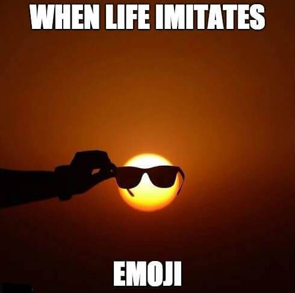
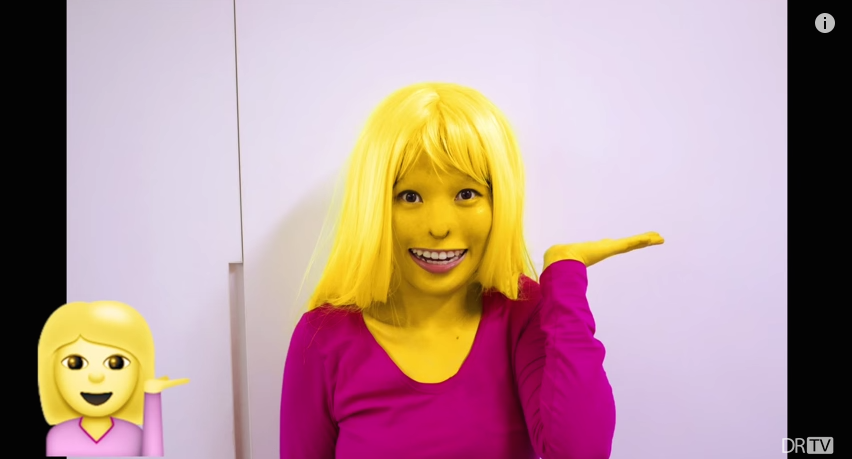
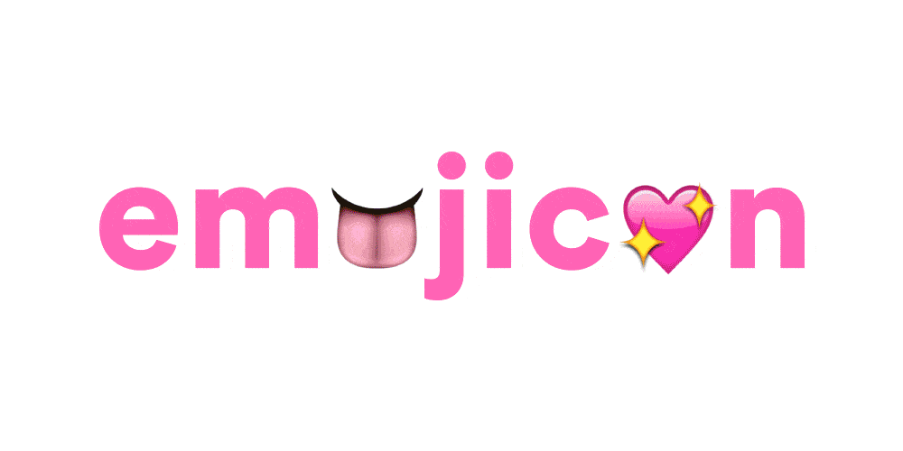
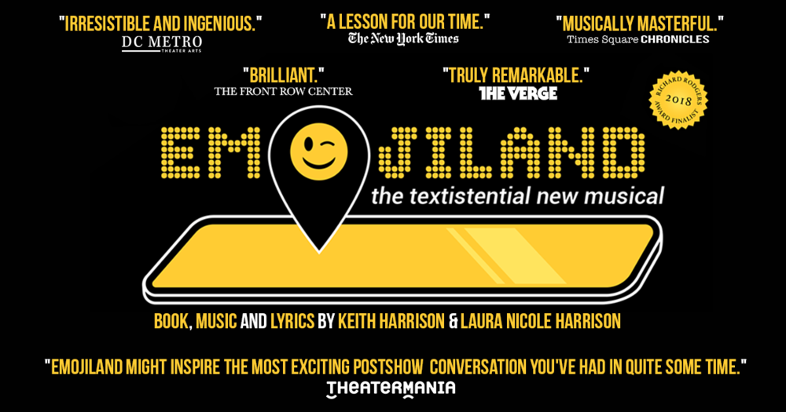
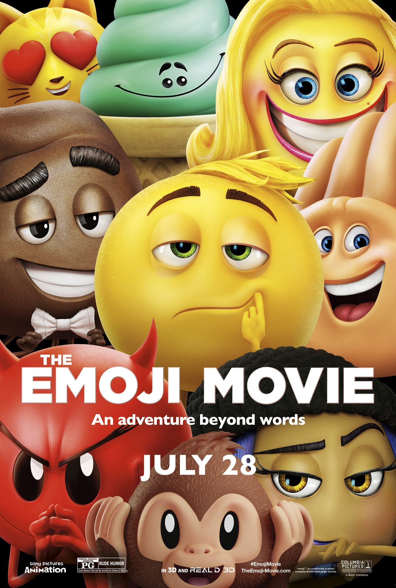
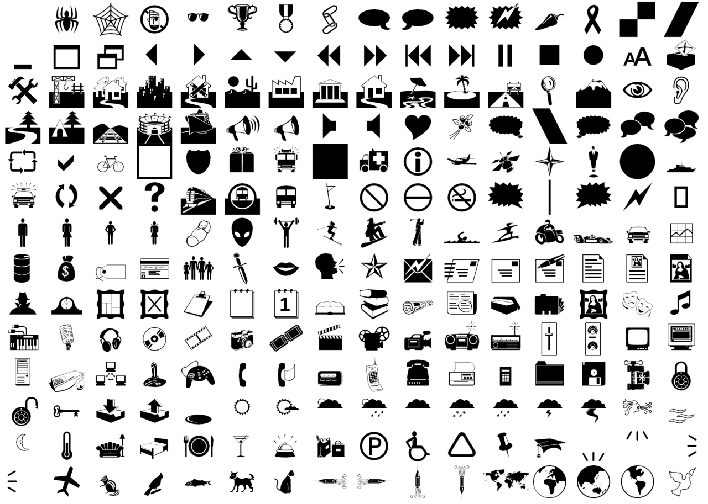
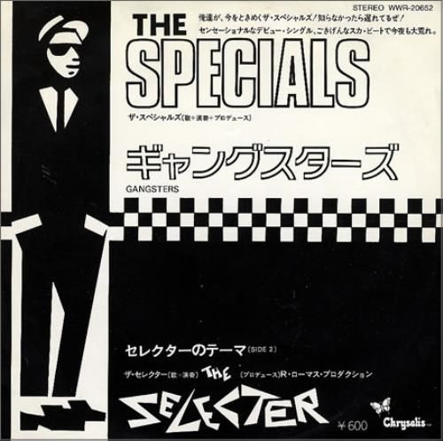
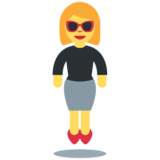
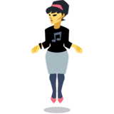

# 😇🤤😬😀😁😂😃😄😅😆😉😊😋😌😍😎😏🤑🤓😗😘🤗😙😚😛😜😝🤣🙂🙃🥰💩

Notes:
* Emoji: it's everywhere

---

 <!-- .element class="plain stretch"-->

Notes:
* From here

---

 <!-- .element class="plain stretch"-->

Notes:
* To here

---

 <!-- .element class="plain stretch"-->

Notes:
* ...to here
* One-day conf in Brooklyn, NY
* With a spelling bee???

---

 <!-- .element class="plain stretch"-->

Notes:
* ...to here
* Existential crises of emoji
* 'Emojiland' review: Come for the 💩, stay for the 💗 

---

 <!-- .element class="plain stretch img-limit"-->

Notes:
* ...to here!
* "Mind-numbing cinematic malware"
* Or in other words as Rotten Tomatoes says

---

# 🚫

---

# 🤦‍♂️

---

# 👨🏼‍💻
## 🧢🎩👒 

Notes:
* I'm David, I wear many hats - not just this one

---

# 🤔

Notes:
* But how did we get here?

---

# 🌃

Notes:
* TONGIHT We **could** talk about:

---

# 😂

Notes:
* Why the joy emoji was Oxford dictionary's word of the year in 2015
* Yes, seriously

---

# :-(

Notes:
* Or...why the guy that created Emoticons hates emoji
* In other words

---

## (╯°□°）╯︵ ┻━┻)

Notes:

* ARGH!
* Called **Kaomoji** btw -- lit. face character in Japanese

---

# �
## U+FFFD

Notes:
* I'm going to cover one specific emoji
* But which one?
* Btw, not an emoji, that's the REPLACEMENT CHARACTER
* You'll see that when a Unicode character isn't able to be displayed on your
  device (eg new emoji on an old device)

---

# ⏳ 🇯🇵

## 絵文字

Notes:
* Brief history
* Emoji literally means "e" (picture) + "moji" (character)
* Naming similarity with emotion/emoticon is complete coincidence
* First emoji set on a Japanese phone in 1997
* Wider set created by telco NTT DoCoMo in 1999 (show original art)

---

 <!-- .element class="plain stretch"-->

Notes:
* 176 chars, 12x12 grid, completely non-standard
* Now a **MUSEUM piece** with MoMA in NYC!
* Anyway, telcos in Japan started to compete
* FF a bit and who's better at marketing than anyone?

---

# 🍏

Notes:

* Apple's appeal to Japanese market lead to inclusion of a then-non
  standard emoji keyboard
* Hidden from English-speaking markets
* People found it, used it and Apple realised the cultural importance
* In other words...

---

# 💰

---

# 🙌🏻

Notes:
* Now: we have a growing set of standardised characters as part of the Unicode standard

---

# 🦖🌮🌯🦄

Notes:
* Fun emoji

---

# 🎅🏿🤦🏻‍♀️🧛‍♀️
# 👩‍❤️‍💋‍👩👬👨🏾‍🦲

Notes:
* Culturally diverse emoji

---

# 🧜🏼‍♂️ 🧜‍♀️

Notes:
* And weird emoji

---

# 🕴

Notes:
* And one of the weirdest of all

---

# 🕴
### MAN IN BUSINESS SUIT LEVITATING
#### Unicode: U+1F574

Notes:
* Introduced in Unicode 7.0 in 2014
* AKA "man in suit levitating"
* But why is it so?
* Well, turns out the Unicode Consortium noted that Wingdings and Webdings
  were in common usage given their prevalence from MS Windows
* They decided to include **ALL** the glyphs not already part of Unicode

---

 <!-- .element class="plain logo" -->

Notes:
* Webdings version
* Webdings was created in 1997
* Shipped with Internet Explorer 4.0 and with Windows 98 onwards
* But why is it so?

---

 <!-- .element class="plain stretch img-limit"-->

Notes:
* Webdings has 230 characters, stuff Microsoft's designers thought "useful"
* Vincent Connare, designer of Comic Sans, is the one responsible

---

# "jump" <!-- .element style="font-family: 'Comic Sans MS';" -->

Notes:
* The word "jump" was on the list of symbols that Vincent was perusuing so see
  what he'd be interested in working on
* He thought "Jump" equals "jupming, pogo-ing man"
* He had a ska-genre Japanese import CD by a band called "The Specials", whose
  record label logo was on it...

---

 <!-- .element class="plain stretch img-limit"-->

Notes:
* Look familiar?
* This is part of the 2 Tone Records logo, and it appeared across their
  label's artists from 1979 to 1985
* On the left is our boy - the figure 2 Tone called "Walt Jabsco"
* "Rude boy" style, British Ska -- black suit, white shirt, tie, pork pie hat & loafters
* The name came from an old op-shop American bowling shirt the label's founder
  purchased -- and "Walt Jabsco" was embroidered on the shirt
* But why is it so?

---

 <!-- .element class="plain stretch img-limit"-->
 <!-- .element class="plain stretch img-limit"-->

# 🕴

Notes:
* Well, and finally, here's the inspiration
* The album artwork of a reggae band from the mid-60s called the Wailing
  Wailers
* The gent on the right is Peter Tosh, and the 2 Tone label chose him,
  describing the look as "Defiant & Jamaican & Hard"

---

# 👨🏿‍🎤➕🎵➕🎳👕➕💻➕🕸➕⏳=🕴

Notes:
* So there you go.
* Reggae, ska music, a bowling shirt, IE 4.0, Windows 98, the web and a whole
  lotta time equals our new friend

---

# 🕴🕴🏻🕴🏼🕴🏽🕴🏾🕴🏿

Notes:
* And now we have skin tone colours too
* Added in Unicode 8.0 in 2015
* No gendered version yet but some non-standard versions have appeared

---

 <!-- .element class="plain stretch"-->
 <!-- .element class="plain stretch"-->

---

# 🎬
